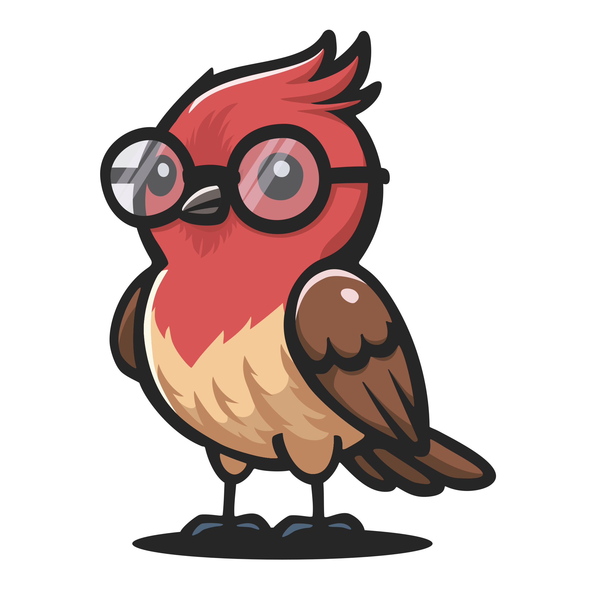

# Smartfinch · Schlaumeise

<p align="center">
  
</p>

<p align="center">
  <a href="LICENSE"></a>
  =3.27">
  
  
</p>

**A bird-collecting game for children.** Every bird you hear is one you have found. The phone listens, names what it hears, and the bird goes into a collection that is yours and stays on your device.

Rarer birds are worth more — and what counts as rare depends on where you are and what week it is, so the same blackbird is worth 50 stars all year and a redwing is worth a thousand in November. That is the whole point: it makes going outside in February interesting.

> **The app has two names.** In German it is **Schlaumeise**; in every other language it is **Smartfinch**. They are not translations of one another — *Schlaumeise* is a tit and a pun that only works in German — so each has its own logo and the launcher shows whichever the device's language calls for.

Built with Flutter for Android, iOS and Windows. Identification runs on-device with the BirdNET+ model; nothing is uploaded, and the app works with no internet at all.

---

## What it does

- **Live** — press one button and listen. Birds appear as they are heard, and the first find of a species is worth three times its value.
- **The collection** — every species you have ever heard, and a second view for this calendar year that starts again each January.
- **The journal** — organised by *day*, not by recording: zoom out to weeks, months or years, open a day to see every species, every star and every time you heard it.
- **Points, badges and achievements** — a daily and weekly badge catalogue, rarity and persistence achievements, and a level ladder from egg to legend that your bird grows along.
- **Explore** — every species that occurs where you are, with a 48-week curve per species and a sentence explaining when it is early.
- **Share a day** — one rendered card: date, stars, species. No audio, no coordinates, no names of places. It is the only picture the app ever makes for someone else.
- **Backup** — the whole collection as one file, recordings included if you want them. There is no account and no cloud; this is what stands between a broken phone and a lost collection.
- **Twelve languages** — English, German, Czech, Spanish, French, Italian, Portuguese, Dutch, Norwegian Bokmål, Polish, Russian and Simplified Chinese.

## What it does not do

No account, no leaderboard, no advertising, no purchases. Location is coarsened to a 0.1° grid cell before it is stored and never leaves the device. Nothing a child types — the names they give their favourite places — is ever rendered into anything shareable.

## Install

Built from source for now; there is no store listing yet. See [Quick Start](#quick-start) below.

## Quick Start

### Prerequisites

- [Flutter SDK](https://flutter.dev/docs/get-started/install) (3.27+ with Dart 3.7+)
- [Git LFS](https://git-lfs.com/) for the large ONNX model files
- [Android Studio](https://developer.android.com/studio) (for Android SDK & emulator)
- Xcode (macOS only, for iOS development)

### Setup

```bash
git clone https://github.com/rajsei/smartfinch-live-app.git
cd smartfinch-live-app
git lfs install
git lfs pull
flutter pub get
flutter gen-l10n
```

Do not skip the LFS step on a fresh clone. The two `.onnx` model files under `assets/models/` are stored with Git LFS; without the real files the app may build from pointer files but model loading will fail at runtime. You only need to run the Python model build pipeline in `dev/` when updating or rebuilding the models themselves.

### Verify

```bash
flutter doctor    # Check Flutter setup
flutter test      # Run tests
flutter analyze   # Check for issues
```

## Deploy to Phone

### Android (USB — Windows / macOS / Linux)

1. **Enable Developer Options** on your phone: Settings → About phone → tap "Build number" 7 times.
2. **Enable USB debugging**: Settings → Developer options → USB debugging → On.
3. **Connect** phone via USB and accept the debugging prompt.
4. **Check** Flutter sees the device:
   ```bash
   flutter devices
   ```
5. **Run** (debug mode with hot reload):
   ```bash
   flutter run
   ```
   Or press `F5` in VS Code with the Flutter extension installed.

6. **Build release APK** (optional):
   ```bash
   flutter build apk --release
   ```
   The APK will be at `build/app/outputs/flutter-apk/app-release.apk`. It is self-contained for sideloading and includes the ONNX models. Transfer it to your phone and install.

### Android (Wireless — Windows)

1. Complete steps 1–3 above (USB debugging on, phone connected via USB).
2. **Pair** over Wi-Fi (Android 11+):
   ```bash
   # On the phone: Developer options → Wireless debugging → Pair device with pairing code
   # Note the IP:port and pairing code shown
   adb pair <ip>:<port>
   # Enter the pairing code when prompted
   ```
3. **Connect** wirelessly:
   ```bash
   adb connect <ip>:<port>
   # Use the port shown under "Wireless debugging" (not the pairing port)
   ```
4. **Unplug** the USB cable. Run as usual:
   ```bash
   flutter run
   ```

### iOS (macOS only)

1. **Connect** iPhone via USB.
2. **Trust** the computer on the phone when prompted.
3. **Open** `ios/Runner.xcworkspace` in Xcode and set your signing team under Signing & Capabilities.
4. **Run**:
   ```bash
   flutter run
   ```
   Or press `F5` in VS Code.

### VS Code Tips

- Install the **Flutter** and **Dart** extensions.
- Select your target device in the status bar (bottom-right).
- `F5` to launch with debugger attached.
- `Ctrl+F5` to launch without debugger (faster startup).
- Use the hot reload button (⚡) or `r` in the terminal for quick iterations.
- `R` in the terminal for hot restart (resets state).

## Documentation

- **User & Developer Docs**: the `docs/` directory in this repository (MkDocs Material). There is no published site yet — the one at `birdnet-team.github.io` documents BirdNET Live, which this app is derived from but no longer resembles.

To preview the documentation locally:

```bash
pip install mkdocs mkdocs-material mkdocs-static-i18n pymdown-extensions
mkdocs serve
```

Then open [http://127.0.0.1:8000](http://127.0.0.1:8000) in your browser.

## Project Structure

```
lib/
  core/           # Constants, theme, utilities, extensions
  features/       # Feature modules (live, point_count, survey, file_analysis,
                  #   aru, audio, recording, spectrogram, inference, explore,
                  #   announcements, history, settings, home, onboarding, about)
  l10n/          # Localization ARB files (en, de, cs, es, fr, it, pt, nl, nb, pl, ru, zh)
  shared/         # Shared models, providers, services, widgets
                  #   (e.g. ContentWidthConstraint for tablet max-width)

docs/             # MkDocs source for GitHub Pages documentation
assets/           # App assets (LFS ONNX models, species data, images, fonts)
  announcements/  # Spoken announcement phrasing per locale (second translation
                  #   surface — see assets/announcements/README.md)
test/             # Tests mirroring lib/ structure
```

## Model Assets

Smartfinch runs fully on-device, so the model assets are part of the checkout/build rather than downloaded by the app at runtime. The large `.onnx` files in `assets/models/` are tracked with Git LFS:

- `BirdNET+_V3.0-preview3.1_Global_10K-pruned_FP16.onnx` — audio classifier (~65 MB)
- `BirdNET+_Geomodel_V3.0.4_Global_10K-pruned_FP16.onnx` — location-based species model (~13 MB)

Release APKs for sideloading keep those models inside `flutter_assets`. Play Store App Bundles move the `.onnx` files into the install-time `models_pack` asset pack so the base module stays below Play's size limit while still working offline after installation.

## Development

```bash
flutter run          # Run with hot reload
flutter test         # Run tests
flutter analyze      # Static analysis
dart format .        # Format code
```

See [CONTRIBUTING.md](CONTRIBUTING.md) for guidelines.

### Contributing Translations

Translations are very welcome contributions, and they cover **two** surfaces — both need updating for a language to be complete:

- **UI strings** — ARB files in `lib/l10n/`. See [CONTRIBUTING.md](CONTRIBUTING.md#translation-contributions).
- **Spoken announcement phrasing** — the sentences the app says out loud, in `assets/announcements/templates_<locale>.json`. See [assets/announcements/README.md](assets/announcements/README.md).

The announcement templates are not in ARB because each entry is a *list* of interchangeable variants rather than a single string. A missing or incomplete template file falls back to English silently, so it is easy to ship a "complete" translation that still speaks English.

## License

- **Source Code**: The source code for this project is licensed under the [MIT License](https://opensource.org/licenses/MIT).
- **Models**: The bundled BirdNET model weights are licensed under the [Apache License 2.0](MODEL_LICENSE).

Please ensure you review and adhere to the specific license terms provided with each model.

## Acceptable Use

Please refer to the [Acceptable Use Policy](ACCEPTABLE_USE.md) for responsible-use guidance for BirdNET and Smartfinch.

## Citation

If you use this app in your scientific work, please cite it using the following BibTeX entry:

```bibtex
@software{Smartfinch_2026,
  author = {Kahl, Stefan and Börner, Andy and Mauermann, Max and Seifert, Raja Charlotte and Lasseck, Mario and Wilhelm-Stein, Thomas and Wood, Connor M. and Eibl, Maximilian and Klinck, Holger},
  title = {{Smartfinch — a bird-collecting game for children}},
  url = {https://github.com/rajsei/smartfinch-live-app},
  year = {2026}
}
```

## Funding

Our work in the Cornell K. Lisa Yang Center for Conservation Bioacoustics is made possible by the generosity of K. Lisa Yang to advance innovative conservation technologies to inspire and inform the conservation of wildlife and habitats.

The development of BirdNET is supported by the German Federal Ministry of Research, Technology and Space (FKZ 01|S22072), the German Federal Ministry for the Environment, Climate Action, Nature Conservation and Nuclear Safety (FKZ 67KI31040E), the German Federal Ministry of Economic Affairs and Energy (FKZ 16KN095550), the Deutsche Bundesstiftung Umwelt (project 39263/01) and the European Social Fund.

## Partners

BirdNET is a joint effort of partners from academia and industry.
Without these partnerships, this project would not have been possible.
Thank you!


